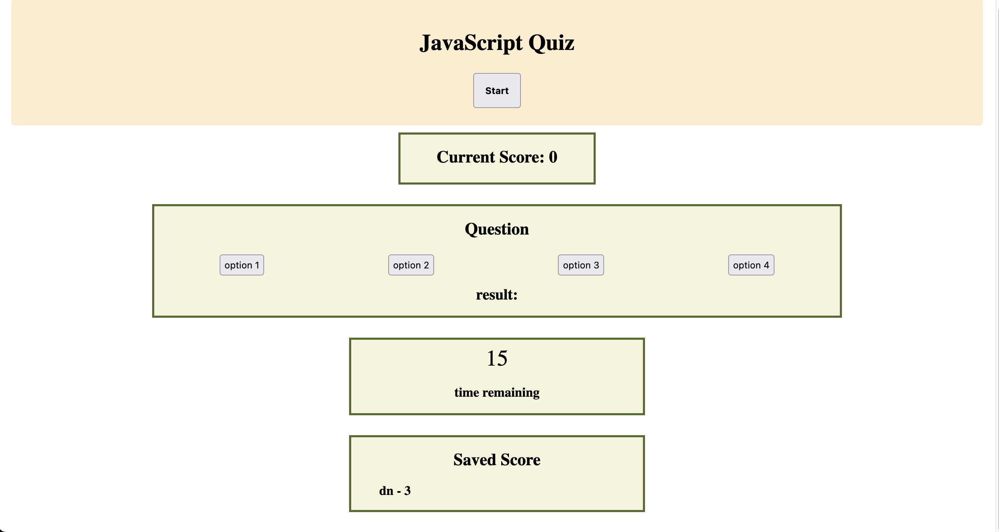

# Timed JavaScript Quiz

## Description
This is a timed 3-question quiz created from JavaScript, HTML, and CSS.
Link to deployed application: https://dannynvn.github.io/project-timed_coding_quiz/

## Usage
This application includes the following functionality:
- a start button that triggers the quiz to begin
- a 15 second timer that counts down to 0
- storing the user's previous score in local storage and is persistent on page as user reloads browser
- score increments when correct answer is chosen; timer decrements when wrong answer is chosen

## Screenshot

